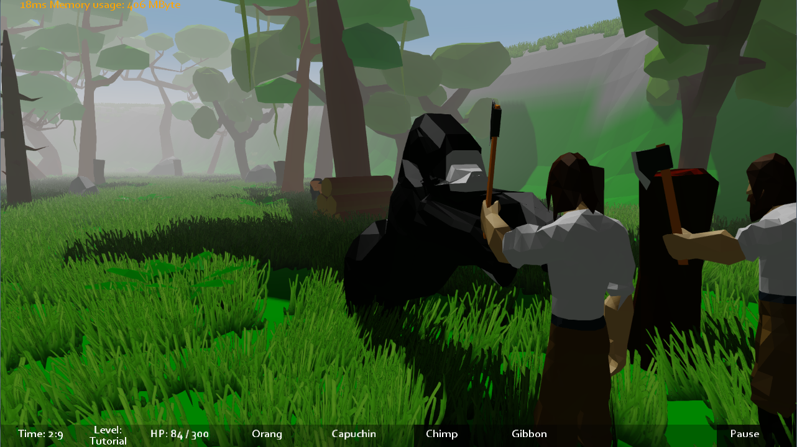
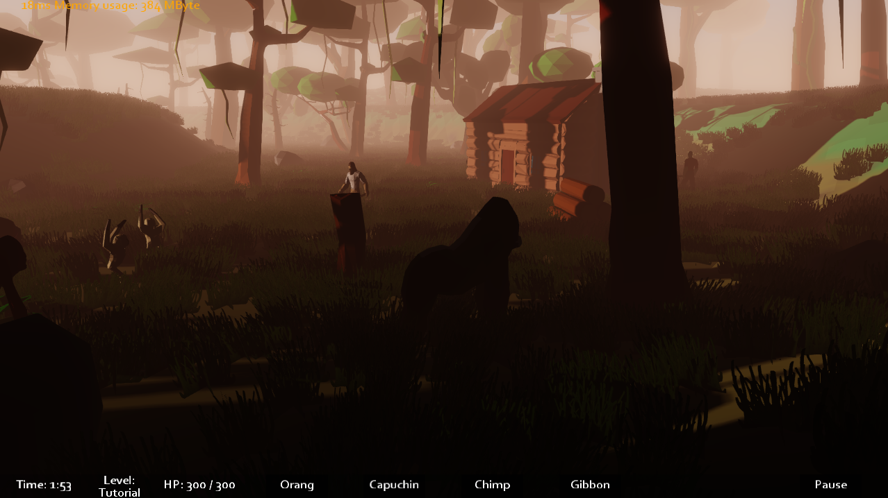
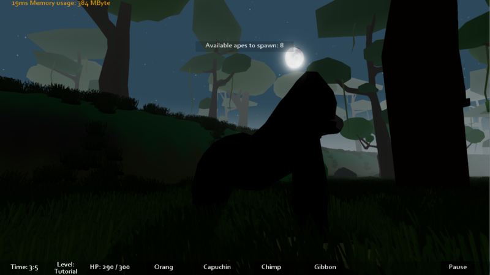
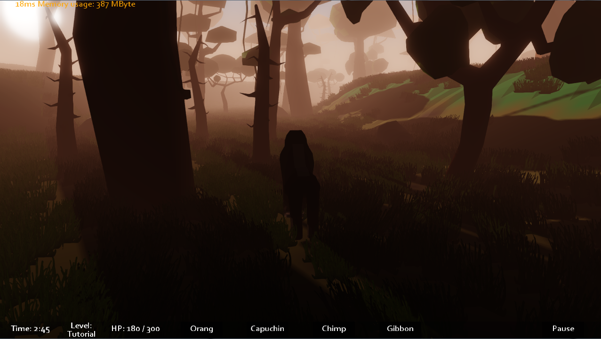
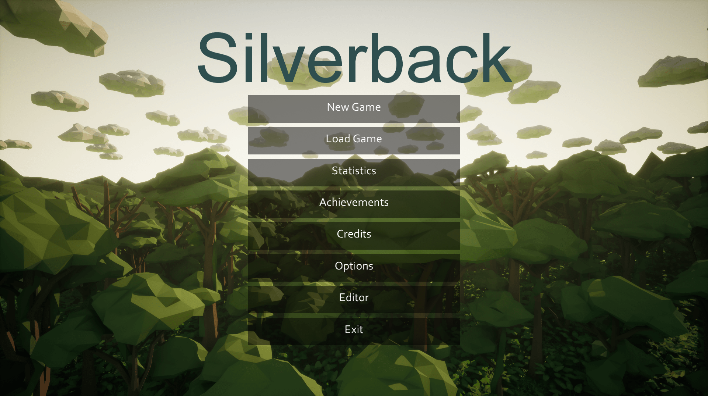
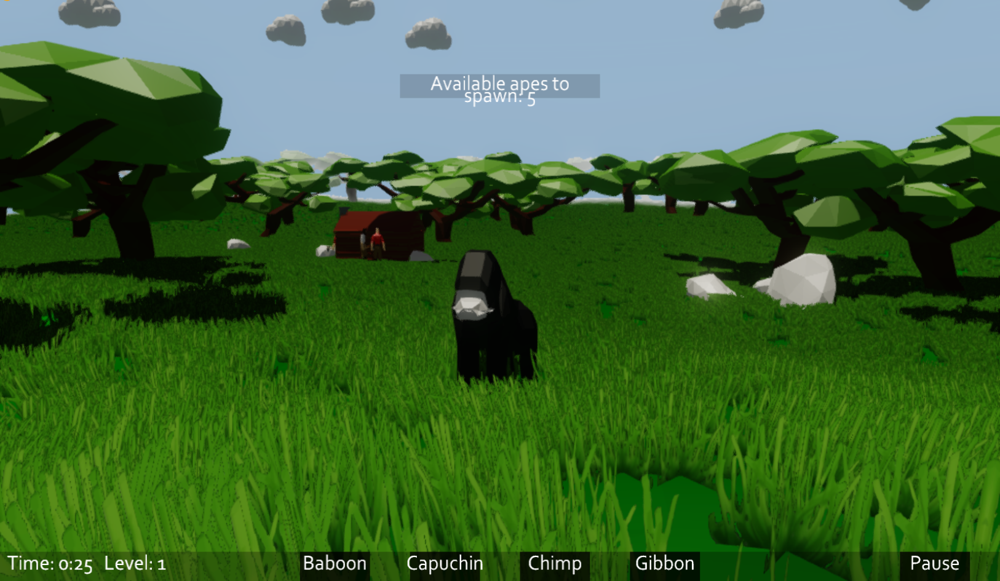
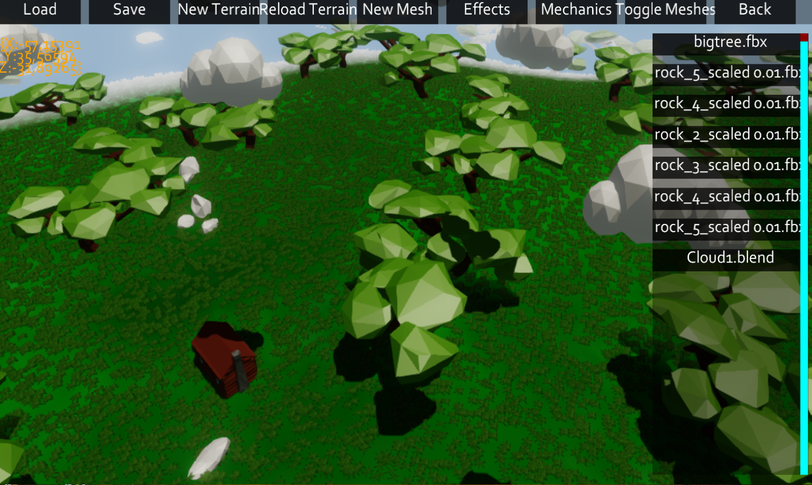
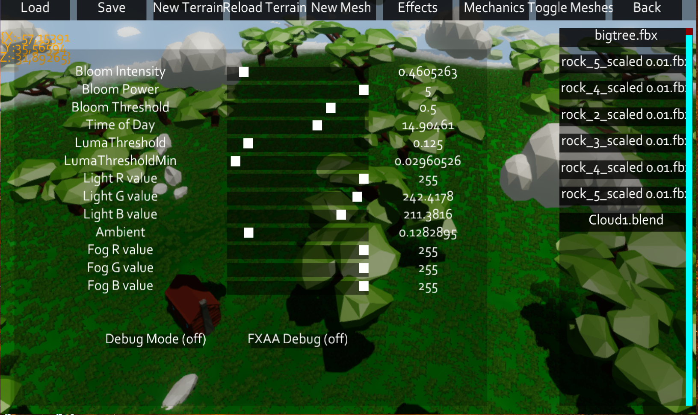

# Silverback - The Game

**Caution this is not the final version, as seen on some of the screenshots.**

This Game is developed as a part of the Softwarepraktikum,
a course at the University of Freiburg.

The main development takes place on university systems,
so this repository may not represent the newest state of the game.
Further the game may contain bugs.

All code belongs to the members of Group 3 - Softwarepraktikum, Univeristy of Freiburg 

##  Images

### Ingame Footage of the final version

### The main screen

### Game (early version)

### Build in leveleditor

### Leveleditorsettings

